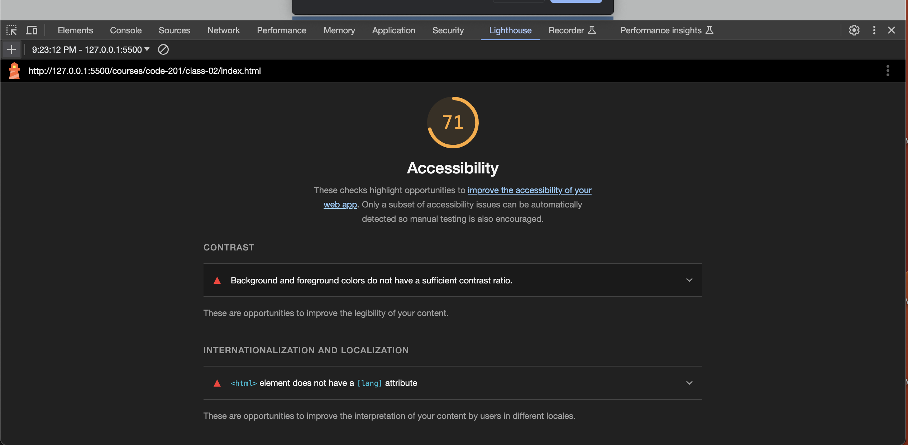

# LAB - 02

## About Me

I created a webpage that quizzes users on five facts about me, using JavaScript. The HTML/CSS allows the webpage to display basic information about me to the user.

### Author: Stephanie G. Johnson

### Links and Resources

* [Submission URL](https://github.com/StepheeGee/class-02.git)

* [Command+shift+M](https://stackoverflow.com/questions/58017905/how-to-find-out-problems-in-this-file-errors-in-vs-code): How to find errors in VS Code

### Lighthouse Accessibility Report Score

* Provide a screenshot of your score after running a Lighthouse Accessibility report.

### Reflections and Comments

This was rough for me. I couldn't get my js to work for like an hour because I forgot to comment out the comment out the full set of code from my first try. Also, the nested if else statements got really confusing. I had to draw an actual diagram to figure out where I was going. My validation kept messing up, which was frustrating. Especially when I went back to add alerts instead of just console.log. One issue that I know I've created is that if the correct name is not entered, the user receives an alert to enter the correct name. But it's not a prompt. So I have to fix that. 

I've learned that I have to pay attention and not make simple mistakes of omission. I also learned that when you 'use strict' JS, you can't use name as a variable. I had to use userName. I also learned that files that start with dot are hidden. So I had to get help from a TA to locate the configuration files. 

It took me about 5 hours to complete this. And I didn't know how long it would take, but I wish it hadn't taken so long. I'm frustrated at this point. 
