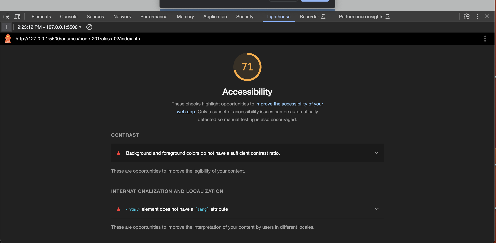

# LAB - 02

## About Me

I created a webpage that quizzes users on five facts about me, using JavaScript. The HTML/CSS allows the webpage to display basic information about me to the user.

### Author: Stephanie G. Johnson

### Links and Resources

* [Submission URL](https://github.com/StepheeGee/aboutme.git)

* [Command+shift+M](https://stackoverflow.com/questions/58017905/how-to-find-out-problems-in-this-file-errors-in-vs-code): How to find errors in VS Code

### Lighthouse Accessibility Report Score

### Reflections and Comments

This was rough for me. I couldn't get my js to work for like an hour because I forgot to comment out the comment out the full set of code from my first try. Also, the nested if else statements got really confusing. I had to draw an actual diagram to figure out where I was going. My validation kept messing up, which was frustrating. Especially when I went back to add alerts instead of just console.log. One issue that I know I've created is that if the correct name is not entered, the user receives an alert to enter the correct name. But it's not a prompt. So I have to fix that. 

I've learned that I have to pay attention and not make simple mistakes of omission. I also learned that when you 'use strict' JS, you can't use name as a variable. I had to use userName. I also learned that files that start with dot are hidden. So I had to get help from a TA to locate the configuration files. 

It took me about 5 hours to complete this. And I didn't know how long it would take, but I wish it hadn't taken so long. I'm frustrated at this point. 

### 10.24.23 Learning Journal

I do not feel like there are enough hours in the day. And that's the root of my frustration when it comes to learning code. Maintaining a growth mindset proves to be a formidable challenge, particularly when deadlines loom large, and my pace as a novice coder feels less than efficient. I find myself having to force breaks and cut off times, otherwise, I won't be able to maintain my sanity.  I also routinely remind myself that quitting is not an option for me. I've sacrificed too much to be here and learn. 

I try to evaluate my learning by keeping good and thorough notes daily. I include as much information as I can in my reading assignments, just in case I need to rely on it in the future as a resource. I show myself compassion, which is forced lol. Being kind to myself is important, even though I sometimes find it tough. I want to understand everything quickly, but learning takes time and practice.

And just to be frank - I don't know how to measure whether I'm actually learning enough or not. I think I'll be more equipped to evaluate that once I am able to complete some functional project from start to finish. Or, once I feel like my grasp of the concept is solid enough for me to "play" around with the code and explore.