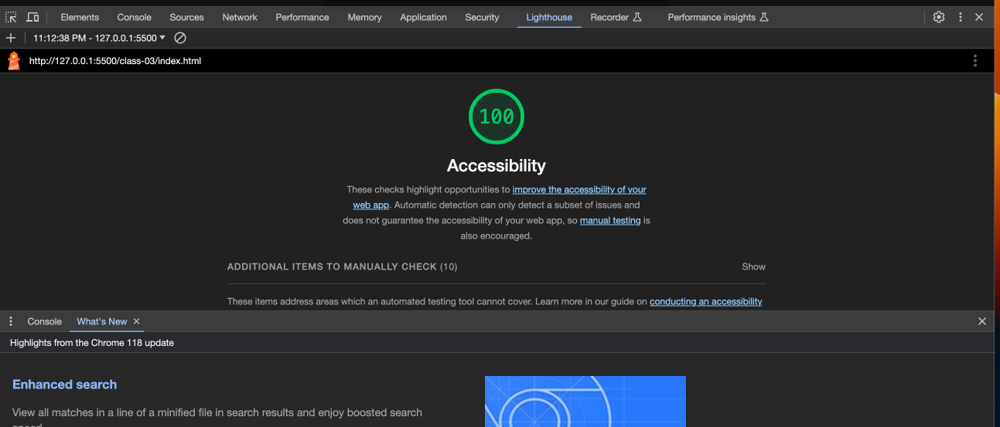

# LAB - 03

## About Me (Extended)

I continues to build off of your lab 02 by adding additional functionality to my About Me Guessing Game. If you'll remember,in lab 02, I created a webpage that quizzes users on five facts about me, using JavaScript. The HTML/CSS allows the webpage to display basic information about me to the user.

### Author: Stephanie G. Johnson

### Links and Resources

* [Submission URL](https://github.com/StepheeGee/aboutme.git)

* [parseInt()](https://developer.mozilla.org/en-US/docs/Web/JavaScript/Reference/Global_Objects/parseInt)

* [The join() method](https://developer.mozilla.org/en-US/docs/Web/JavaScript/Reference/Global_Objects/Array/join)

* [Float CSS](https://css.maxdesign.com.au/floatutorial/tutorial0613.htm)

### Lighthouse Accessibility Report Score

### Reflections and Comments

I tried a lot of new concepts today and they were really difficult so it took a bit of time. I've been working on this assignment since about 4pm, and I'm finishing now at 11:15pm. I do feel like I learned a lot about the fundamentals. Especially with JavaScript. The arrays and loops are always tricky for me. So that took some time and research. But I completed it, and it works. I also had to take some time to unravel some of the work I did yesterday on lab 2. Because this lab required us to keep score of the correct guesses, yesterday's questions, which were nested conditional logic, had to be separated. 

