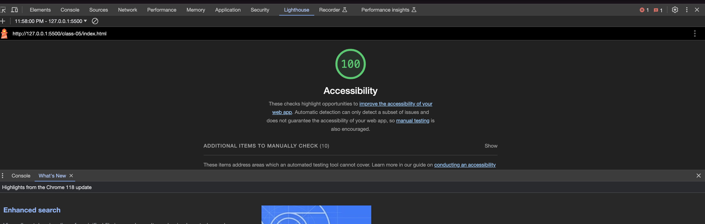

# LAB - 05b

## About Me (Final)
10.27.23

The final improvement on the About Me webpage.

### Author: Stephanie G. Johnson

### Links and Resources

* [Submission URL](https://github.com/StepheeGee/aboutme.git)

### Lighthouse Accessibility Report Score

### Reflections and Comments

I think I did a pretty good job turning the questions into functions - especially using a function for the first five questions. I also implemented some of the feedback that I received on my prior submissions, including having an algorithm to show all the correct answers in the array. 

Learning Journal (Class 05)

*"Adults need to know why to learn something; as soon as they answer this question, they are ready to start."*

This definitely rings true for me. Understanding the 'why' behind what I'm learning provides context, and with context comes greater comprehension. Otherwise, the dots won't connect and I'll find myself stuck in a loop trying to solve for 'why'. (Pun intended)

During today's class demo, where we revisited the topic of JS functions, I experienced a small but significant "aha" moment. Previously, I couldn't quite grasp the utility of functions in our lab exercises. However, today's demonstration shed light on how functions can be used to consolidate our quiz questions, allowing for the efficient execution of multiple questions. That made so much sense to me.

I now understand the purpose of functions in a real-world scenario. They serve as a way to encapsulate and streamline code, making it more organized and easier to manage. I might not know exactly how to create such an overarching function yet, but the understanding that I gained from the demo has made me kind of determined to figure out a similar solution for my AboutMe project.
I'm glad I actually feel inclined to explore the material further, experiment with it, and eventually incorporate it into my projects. It serves as a reminder that comprehending the 'why' is the catalyst for the learning process, moving me forward with a sense of understanding.

